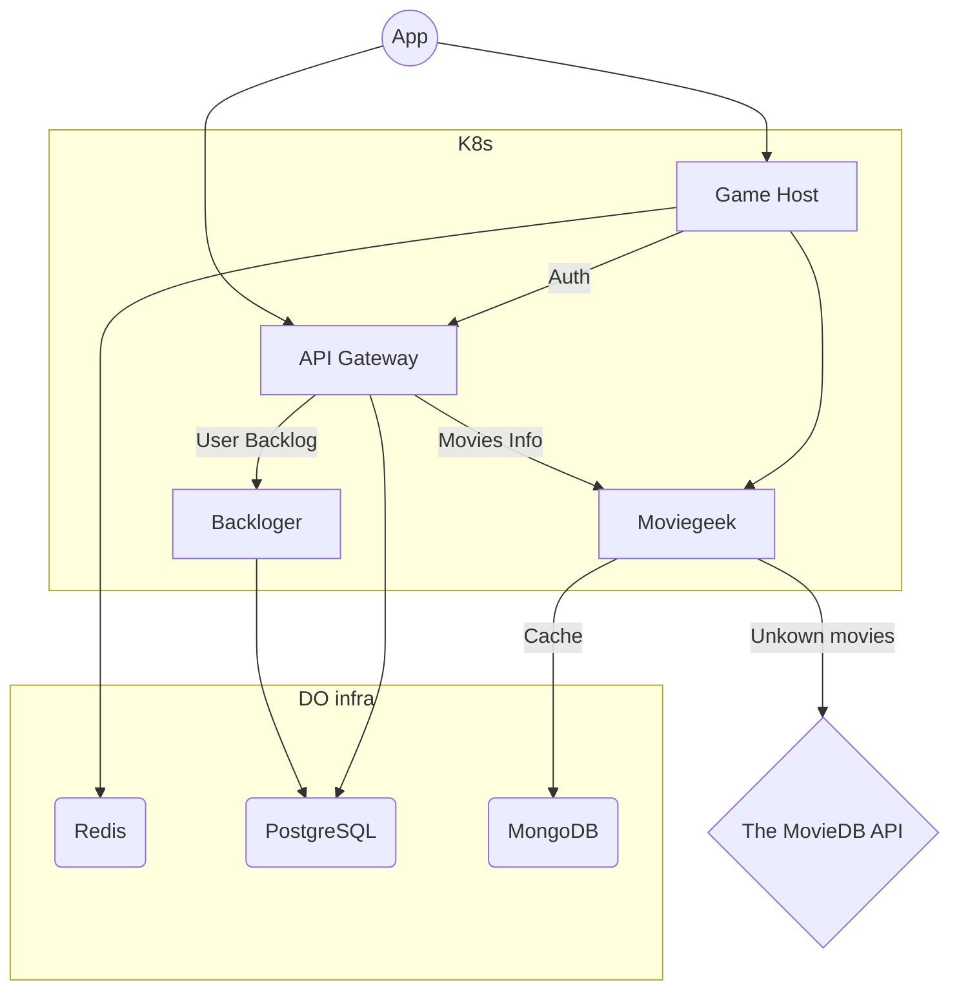

# Evening Popcorn - Backend

---

Evening Popcorn(EP) is basically Tinder for movie night. Also, it allows you to log your backlog.

EP uses a microservice structure for better scalability of separate parts. 
Everything is deployed on DigitalOcean infrastructure but is not dependent on it.

**Used technologies**
- Python 3.11
  - [poerty](https://python-poetry.org) 
  - [FastAPI](https://fastapi.tiangolo.com)
  - [tortoise-orm](https://tortoise.github.io)
  - [yoyo](https://ollycope.com/software/yoyo/latest/)
  - [motor](https://motor.readthedocs.io/en/stable/)
  - [dotenv](https://github.com/theskumar/python-dotenv)
- Go
  - net/http
  - dotenv
  - redis
- Docker + K8s
- PostgreSQL
- MongoDB
- Redis
- GitHub Actions

## Project Overview

---

Project files consist of microservices and supportive code such as Docker images, utils, and integrations clients.

### Microservices

#### API Gateway ([api_gateway](https://github.com/evening-popcorn/evening-popcorn-backend/tree/main/api_gateway))

Written in `Python 3.11` using `FastAPI`

An entry point for the app, except for game endpoints. It handles authorization and authentication and compiles responses from 
different microservices. Using Google's and Apple's OAuth for authorization and getting user info services. 
After login user gets a pair of tokens that should be used in headers and for updating tokens. The token expires 30 and 60 
days after authorization, respectively.

#### Backloger ([backloger](https://github.com/evening-popcorn/evening-popcorn-backend/tree/main/backloger))
Written in `Python 3.11` using `FastAPI`

Microservice handling user's backlog. Every record is stored in PostgreSQL as a pair of `movie_id` and `user_id`.

#### Moviegeek ([moviegeek](https://github.com/evening-popcorn/evening-popcorn-backend/tree/main/moviegeek))

Written in `Python 3.11` using `FastAPI`

Microservice for fetching information about movies. Service gets info about movies from 
[The Movie DB](https://www.themoviedb.org) via official API. Every movie detail is cached inside MongoDB to limit 
requests to The Movie DB. Mongo is used for structuring information for future uses, for example, search suggestions, 
learning data, etc. 

#### Game Host ([game_host](https://github.com/evening-popcorn/evening-popcorn-backend/tree/main/game_host))

Written in `Go` using pure `net/http`

Microservice for initiating and playing game, trying to find matching movies for the evening. As soon as all players swipe 
right same movie - everyone gets a notification about the match.

### Misc

#### Base image ([base_image](https://github.com/evening-popcorn/evening-popcorn-backend/tree/main/base_image))

Base image for all Python microservices. The image contains installed poetry, EP Client, and EP Utils.

#### EP Client ([ep_client](https://github.com/evening-popcorn/evening-popcorn-backend/tree/main/ep_client))

Python client for interacting between services. It contains response objects and everything for making requests

#### EP Utils ([ep_utils](https://github.com/evening-popcorn/evening-popcorn-backend/tree/main/ep_utils))

Various Python utils. Contains object for structuring env variable and creating a template of the `.env` file   

## Services structure

